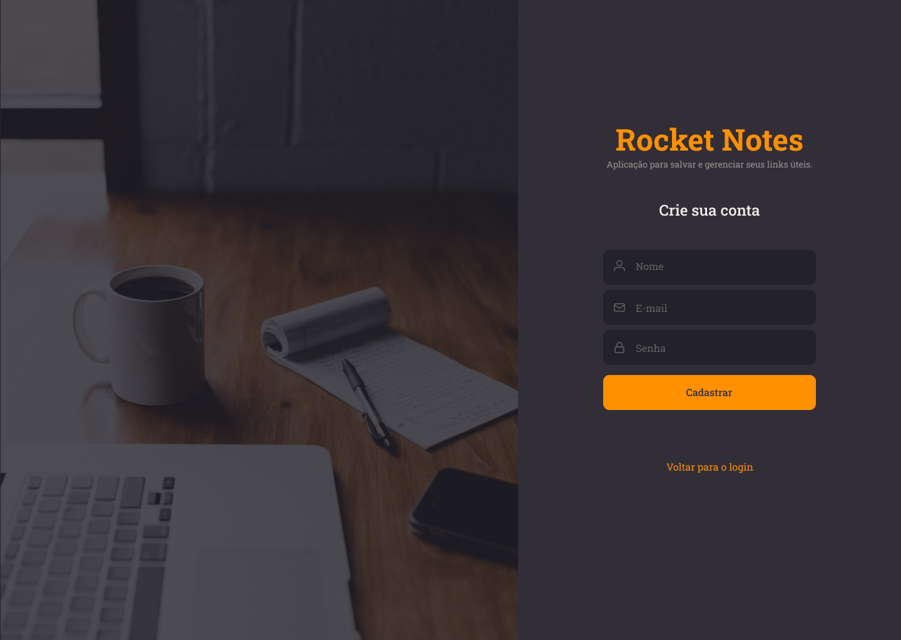
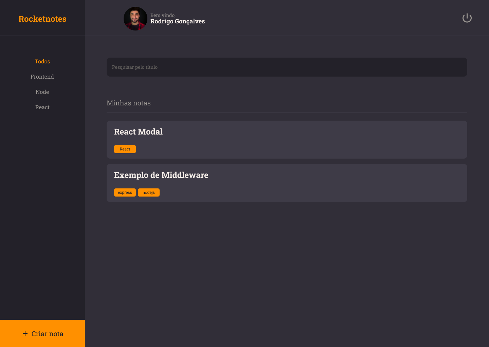
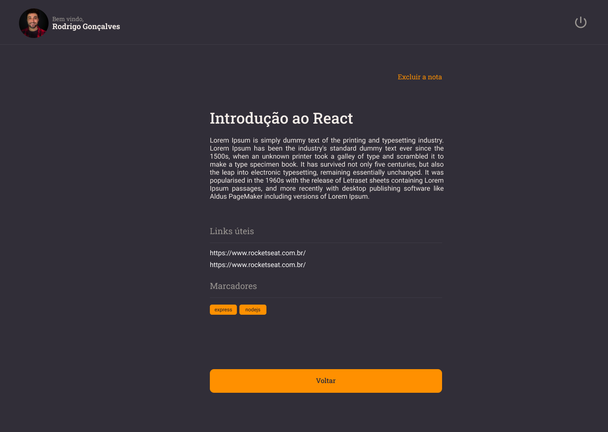
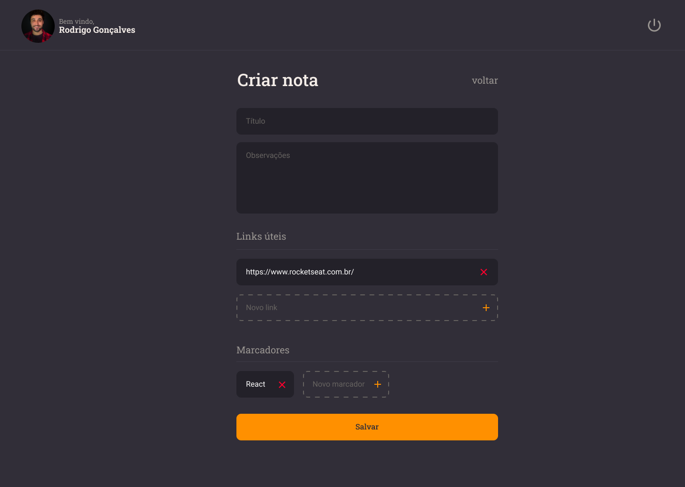

<h1 align="center">
    
    RocketNotes
</h1>

## 💻 About

**Este repositório se trata do front-end da aplicação RocketNotes** ([link do back-end](https://github.com/B3RG5TRON/Explorer_Stage_08_NodeJS_RocketNotes_API)). Esta aplicação disponibiliza aos usuários a possibilidade de realizar um cadastrar e gerar anotações sobre assuntos que desejar.

Vale ressaltar que este projeto faz parte da trilha/curso **Explorer** oferecida pela [Rocketseat](https://www.rocketseat.com.br/) para quem tiver interesse.

---

## 🎨 Layout

Você pode visualizar o layout do projeto através [desse link](https://www.figma.com/design/Au8R7UGQr6z9hmqD8XH5rQ/RocketNotes-(Copy)?m=dev&node-id=0-1). É necessário ter conta no [Figma](https://www.figma.com/) para acessá-lo.

### Web

#### SignUp
<p align="center">
  
</p>

#### SignIn
<p align="center">
  
</p>

#### Home
<p align="center">
  
</p>

#### Perfil
<p align="center">
  
</p>

#### Note Preview
<p align="center">
  
</p>

#### Note Create
<p align="center">
  
</p>

## 🔗 Deploy

Para acessar o deploy do Website da aplicação basta clicar no link a seguir: (Disponível em breve)

> Obs: a aplicação pode demorar um pouco para entrar na primeira execução depois de um tempo, devido ao back-end estar rodando através do plano gratuito na plataforma de hospedagem.

---

## 🚀 How it works

Este é um projeto **Full Stack**, contendo **Front-end** desenvolvido em **React** e o **Back-end** desenvolvido em **Node**. No entanto, **este repositório** se trata apenas do **Front-end**, para acessar o repositório do Back-end clique neste **[link](https://github.com/B3RG5TRON/Explorer_Stage_08_NodeJS_RocketNotes_API)**

### Pré-requisitos

Antes de baixar o projeto você vai precisar ter instalado na sua máquina as seguintes ferramentas:

* [Git](https://git-scm.com)
* [NodeJS](https://nodejs.org/en/)
* [Yarn](https://yarnpkg.com/) ou [NPM](https://www.npmjs.com/)

Além disto é bom ter um editor para trabalhar com o código como [VSCode](https://code.visualstudio.com/)
> Obs: não se esqueça que também é necessário rodar/executar o back-end da aplicação para buscar e checar os dados necessários

#### 🧭 Rodando a aplicação web (Frontend)

```bash
# Clone este repositório
$ gh repo clone B3RG5TRON/Explorer_Stage_09_ReactJS_RocketNotes

# Vá para a pasta da aplicação Front End
$ cd Explorer_Stage_09_ReactJS_RocketNotes

# Instale as dependências
$ npm install

# Execute a aplicação em modo de desenvolvimento
$ npm run dev

# A aplicação será aberta em uma porta especificada no terminal de execução
```
---

## 🛠 Technologies

As seguintes ferramentas foram usadas na construção do projeto:

#### **Website**  ([Vite](https://vitejs.dev/)

-   **[Styled-Components](https://styled-components.com/)**
-   **[React-Toastify](https://fkhadra.github.io/react-toastify/introduction)**
-   **[React-Query](https://react-query-v3.tanstack.com/)**
-   **[React-Icons](https://react-icons.github.io/react-icons/)**
-   **[React-Loader-Spinner](https://mhnpd.github.io/react-loader-spinner/docs/intro)**
-   **[React-Router-DOM](https://reactrouter.com/en/main/start/tutorial)**

> Para mais detalhes das dependências gerais da aplicação veja o arquivo: [package.json](https://github.com/B3RG5TRON/Explorer_Stage_09_ReactJS_RocketNotes/blob/main/package.json)

## ✍ Author

<div align="center">

  

  <p>Created by Eduardo Bergstron 👋🏽</p>
  
  [Linkedin](https://www.linkedin.com/in/eduardo-bergstron-986108143/) | [Email](mailto:eduardo.goudinho@gmail.com)

</div>

---

## 📝 License

Este projeto esta sobe a licença [MIT](./LICENSE).
